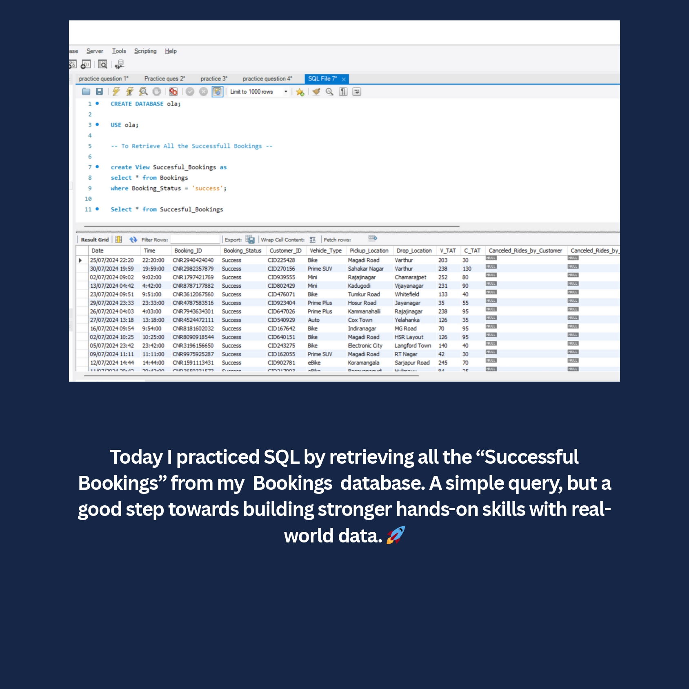
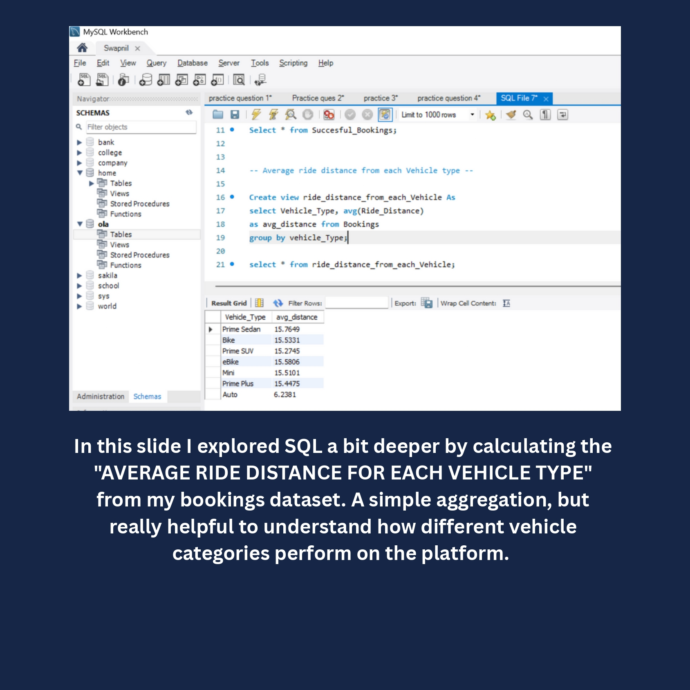
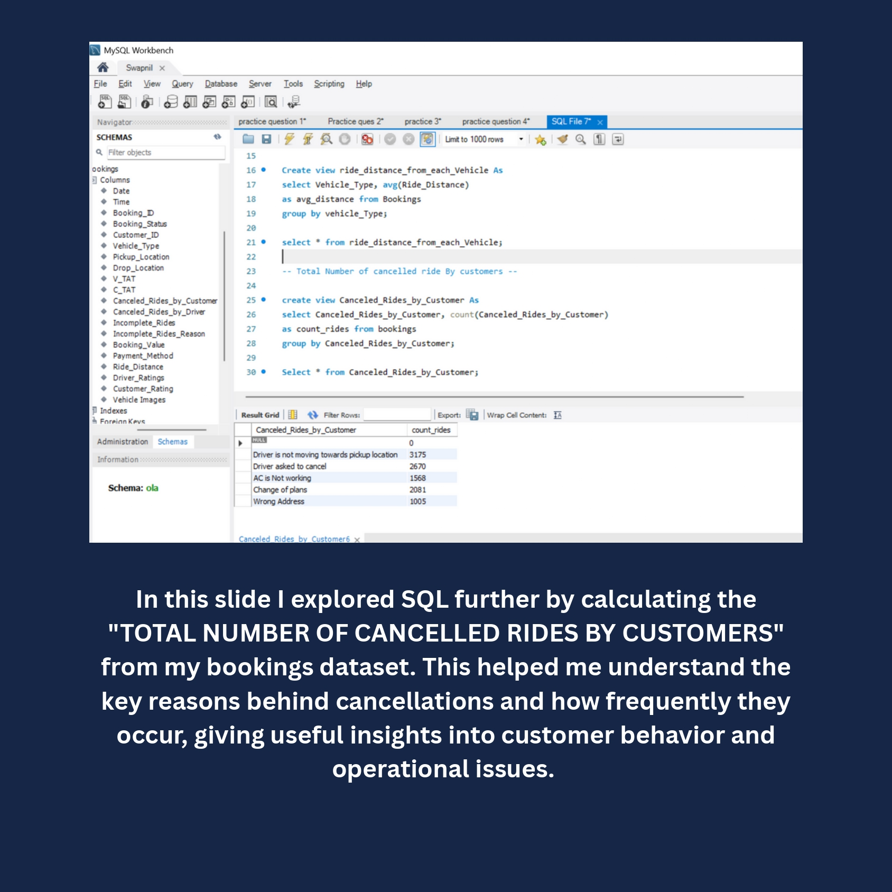
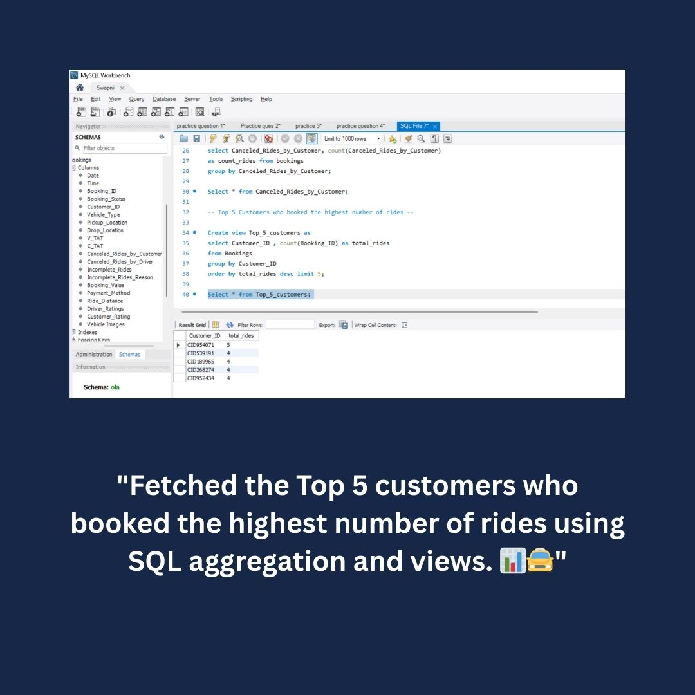
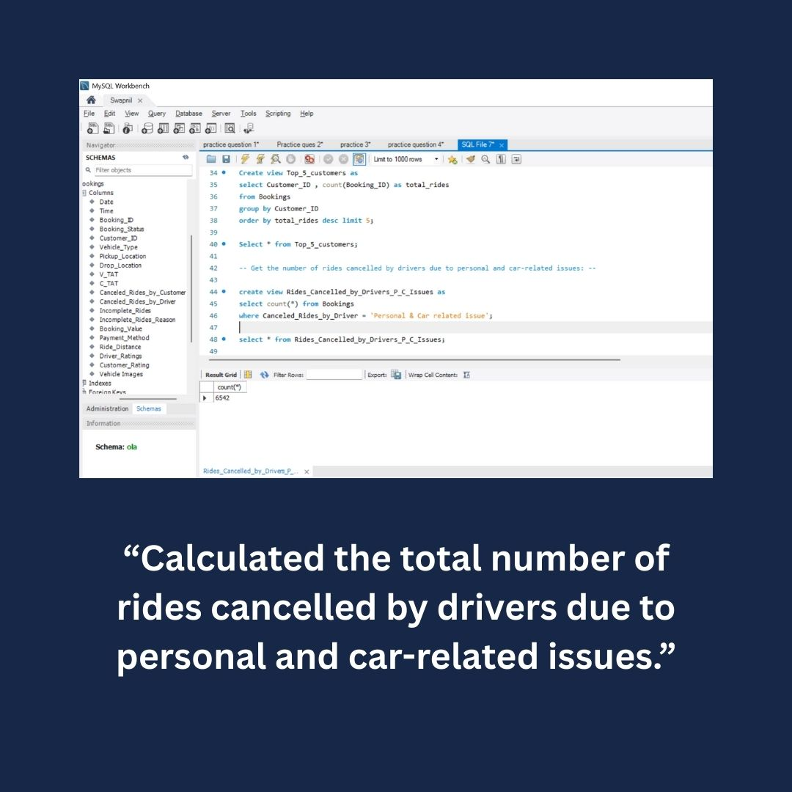
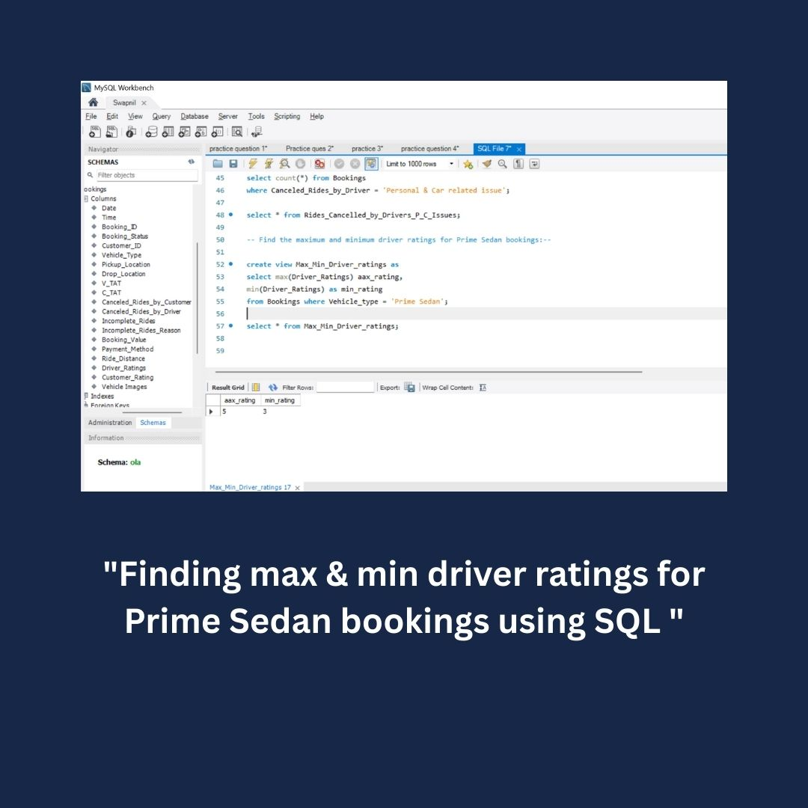
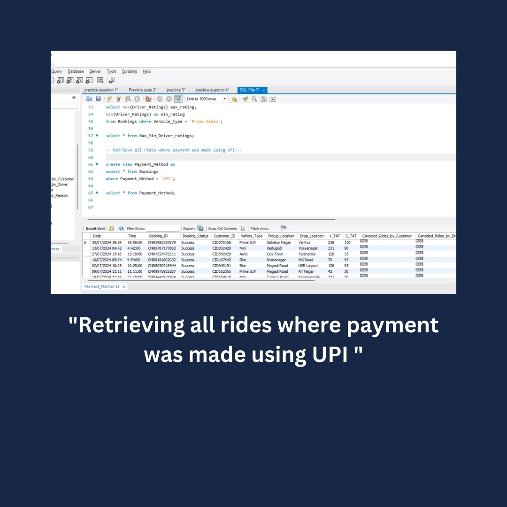
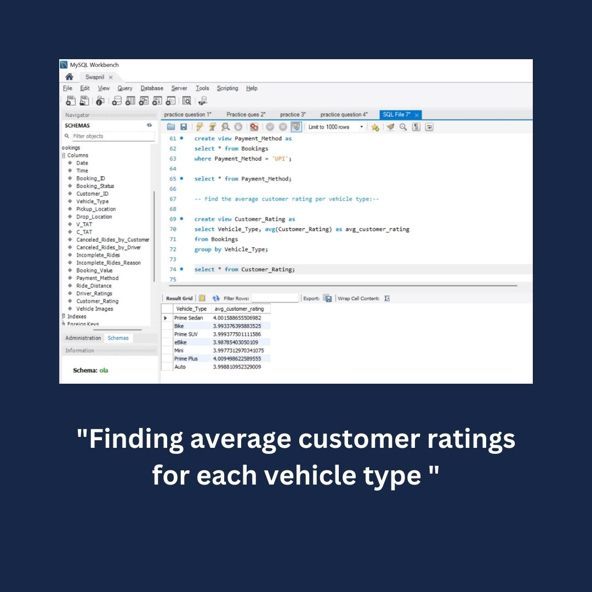
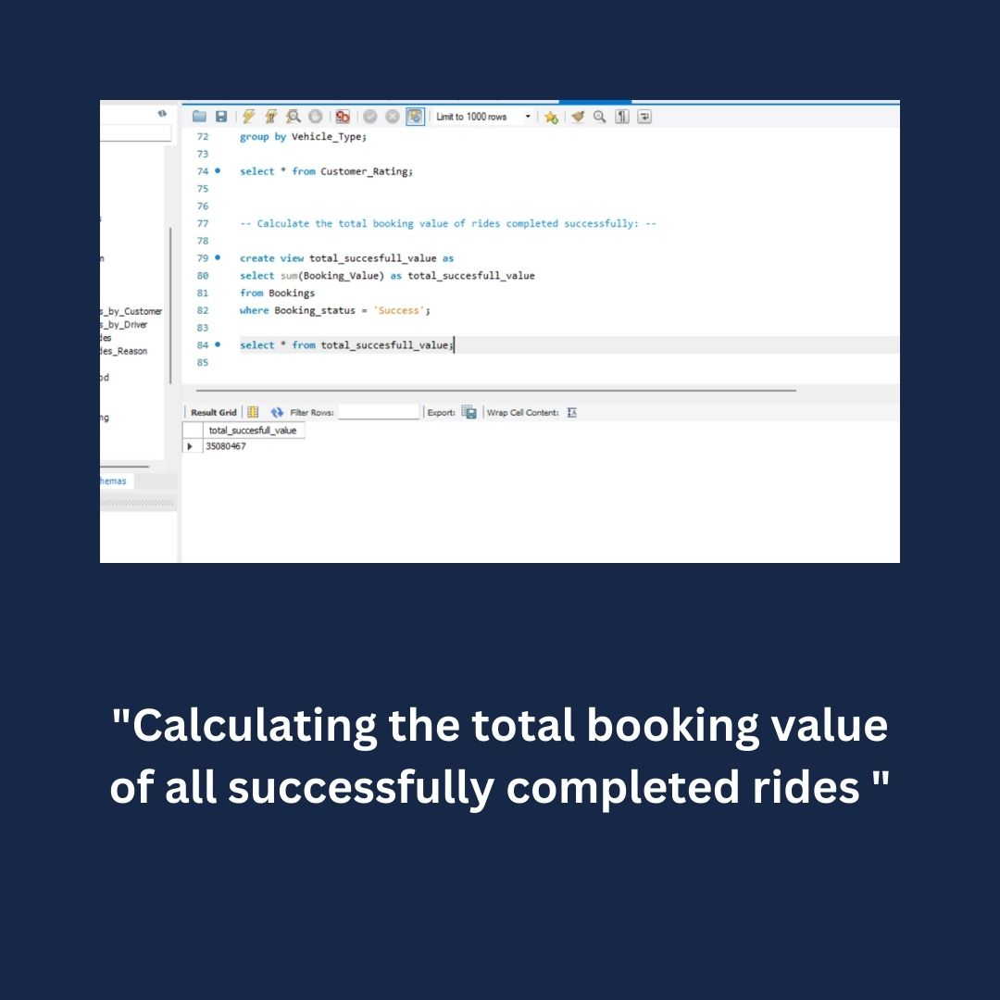
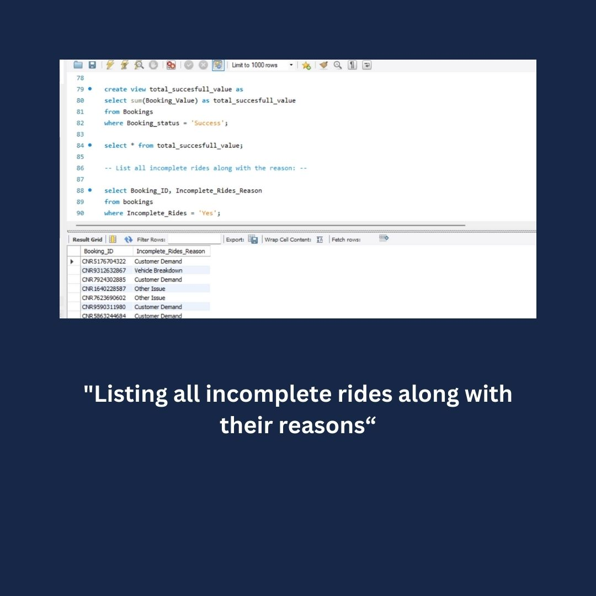

# Rapido-SQL-Analysis

SQL Queries and analysis on Rapido ride booking dataset

## Day - 1

```
CREATE DATABASE ola;
USE ola;
```

-- To Retrieve All the Successful Bookings --

```
CREATE VIEW Successful_Bookings AS
SELECT * FROM Bookings
WHERE Booking_Status = 'Success';

SELECT * FROM Successful_Bookings;
```

-- Average ride distance from each Vehicle type --

```
Create view ride_distance_from_each_Vehicle As
select Vehicle_Type, avg(Ride_Distance)
as avg_distance from Bookings
group by vehicle_Type;

select * from ride_distance_from_each_Vehicle;
```

-- Total Number of cancelled ride By customers --

```
create view Canceled_Rides_by_Customer As
select Canceled_Rides_by_Customer, count(Canceled_Rides_by_Customer)
as count_rides from bookings
group by Canceled_Rides_by_Customer;

Select * from Canceled_Rides_by_Customer;
```






----

## Day - 2

-- Top 5 Customers who booked the highest number of rides --

```
Create view Top_5_customers as
select Customer_ID , count(Booking_ID) as total_rides
from Bookings
group by Customer_ID
order by total_rides desc limit 5;

Select * from Top_5_customers;
```

-- Get the number of rides cancelled by drivers due to personal and car-related issues: --

```
create view Rides_Cancelled_by_Drivers_P_C_Issues as
select count(*) from Bookings
where Canceled_Rides_by_Driver = 'Personal & Car related issue';

select * from Rides_Cancelled_by_Drivers_P_C_Issues;
```

-- Find the maximum and minimum driver ratings for Prime Sedan bookings:--

```
create view Max_Min_Driver_ratings as
select max(Driver_Ratings) aax_rating,
min(Driver_Ratings) as min_rating
from Bookings where Vehicle_type = 'Prime Sedan';

select * from Max_Min_Driver_ratings;
```

-- Retrieve all rides where payment was made using UPI:--

```
create view Payment_Method as
select * from Bookings
where Payment_Method = 'UPI';

select * from Payment_Method;
```

-- Find the average customer rating per vehicle type:--

```
create view Customer_Rating as
select Vehicle_Type, avg(Customer_Rating) as avg_customer_rating
from Bookings
group by Vehicle_Type;

select * from Customer_Rating;

```

-- Calculate the total booking value of rides completed successfully: --

```
create view total_succesfull_value as
select sum(Booking_Value) as total_succesfull_value
from Bookingsf
where Booking_status = 'Success';

select * from total_succesfull_value;
```

-- List all incomplete rides along with the reason: --

```
select Booking_ID, Incomplete_Rides_Reason
from bookings
where Incomplete_Rides = 'Yes';
```









